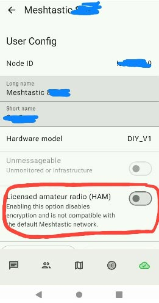
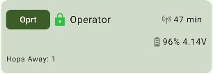
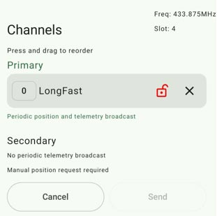
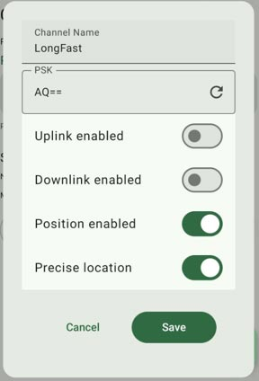
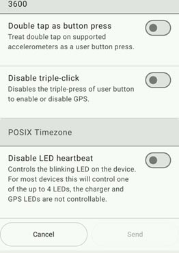
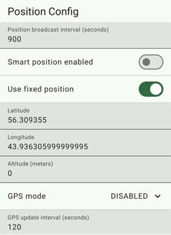
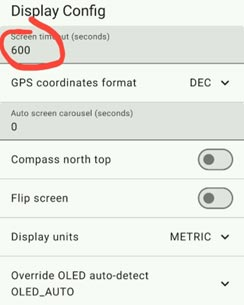
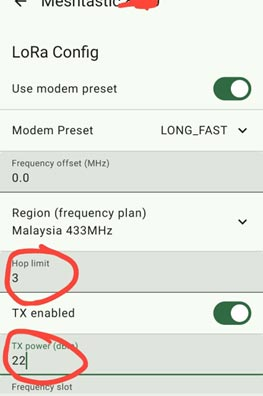

## Настройка ноды

[Официальный гайд по конфигурации](https://meshtastic.org/docs/configuration/).

Нода настраивается через приложение Meshtastic установленное из Google Play, Fdroid, Apple App Store.

В Apple App Store приложение для региона Россия отсутствует.
Для установки следует воспользоваться аккаунтом для другого региона,
либо временно сменить регион на вашем iOS устройстве.

Для выполнения подключения к ноде выполнить сопряжение в списке обнаруженные Bluetooth устройств.

Для устройства с экраном PIN для сопряжение отображается на экране, для устройств без экрана PIN по умолчанию 123456.

В настоящий момент сообщество мештастеров Нижнего Новгорода договорилось об основных параметрах конфигурации нод.

## Настройки «Нижний Новгород – 433MHz»

- LoRa > Region: **Malaysia 433 MHz**
- LoRa > Channels Preset: **LongFast**
- LoRa > Modem preset: **LONG_FAST**
- LoRa > Hop limit: **3**
  - Может быть установлено до 7, если ваша нода находится на окраине покрытия.
- LoRa / TX power: **22**
  - **20** в "не HAM" режиме
- LoRa / Freq slot: **4**
- LoRa / Freq: должна сама выставиться в **433.875**
- Device > Role: **CLIENT**
  - **CLIENT_MUTE** если используется короткая неэффективная антенка “из коробки”.
  - **CLIENT_BASE** для стационарной ноды.
- Device > Rebroadcast mode: **CORE_PORTNUMS_ONLY**
- Device > Nodeinfo broadcast: **3600**
- Device> POSIX Timezone: **MSK-3**

## Настройки «Нижний Новгород – 868MHz»

Все аналогично настройкам на 433 MHz.
- LoRa > Region: **Russia**
- LoRa / Freq slot: **2**

В результате частота должна быть **869.075** MHz

## Пример конфигурации ноды:

### Режим вещания

Обязательно выключить «**HAM**» Режим (Licensed Operator, Licensed Amateur Radio) в настройках пользователя!

В настоящий момент, в связи с увеличением численности пользователей, мы можем перейти на режим «не-HAM» имеющий пониженный сигнал, но имеющий возможность включения шифрования, отсутствие drop пакетов при ретрансляции, признак корректной настройки - **зеленый замок** около имени ноды.

|    |    |
| :--- | ---: |

### Общий канал

Конфигурация общего канала “LongFast” - без изменений, с дефолтным ключом.

Настройки ключа канала (не изменять). Настройки передачи координат (чтобы нода не перемещалась по карте) - убрать отображение с погрешностью, выставить “Precise Location”.

ПРОВЕРЬТЕ НАЛИЧИЕ КЛЮЧА **“AQ==”**, КАК НА СКРИНШОТЕ.

### Режим работы ноды

Если вы используете мобильную ноду или питание от солнечной панели, то для экономии батареи можно отключить мерцание светодиода – “Disable LED heartbeat”.

### Геолокация

В зависимости от комфортного для вас уровня анонимности, вы можете выставить режим передачи координат GPS по сети. В среднем договорились о выставлении приблизительной координаты расположения ноды с погрешностью в один-два километра. Можно выставить режим передачи координат от встроенного GPS модуля, передачу координат со смартфона, передача фиксированных координат.

На скриншоте настроена передача фиксированных заранее заданных вручную координат ноды.

Если вы используете мобильную ноду настройте таймаут выключения экрана в секундах удобный для вас, например 10 секунд.

#### Режимы работы радиомодуля, раздел LORA

Мощность выставляется значением 22 dbm (20 dbm с отключенным режимом HAM), т.к. радиомодуль, получая это значение от прошивки в конфигурации, дополнительно увеличивает его в своей схеме до нужного значения. Детальнее как идет инициализация мощности можно увидеть через usb порт устройства в режиме ком порта, через ПО PUTTY в момент загрузки в логах на экране.

В случае стационарной сборки на модулях 33dBm, значение 22dBm подается на радиомодуль, и в итоге модуль выставляет значение 33dBm по факту.

Тема неоднозначная, и желательно готовую сборку измерить на специальном приборе, измеряющем мощность радиосигнала.

|     |     |
| :--- | ---: |
|      |      |

Второй экран параметров Lora

В настройках BlueTooth можно выставить пароль для доступа по блютус.

- Рандомный (дефолтный режим для устройств с экраном)
- Фиксированный. По умолчанию «123456»

### Удаленное администрирование ноды

Это расширенная функция, предназначенная для опытных пользователей.

Кратко:
- В версиях прошивки 2.5 и выше, удалённое администрирование осуществляется путём сохранения открытого ключа локального узла в одном из полей «Ключ администратора» в конфигурации безопасности удалённого узла. **Этого полностью достаточно для того, чтобы узел управлялся удаленно**.
    1. Подключитесь к локальному узлу, который будет администрировать удаленный узел.
    1. Перейдите в раздел ⋮ > Конфигурация радио > [Безопасность](https://meshtastic.org/docs/configuration/radio/security/#public-key) , чтобы найти его открытый ключ.
    1. Скопируйте открытый ключ, который будет использоваться для настройки удаленного узла.
    1. Подключитесь к узлу, который будет удаленно администрируемым узлом.
    1. Перейдите в то же меню «Безопасность» , что и на шаге 2, и нажмите «Добавить» , чтобы вставить открытый ключ локального узла в поле «Ключ администратора».
    1. Может быть предоставлено до 3 ключей администратора, по одному на поле, что позволяет использовать до 3 управляющих узлов.
    1. Включать опцию "Managed node" не нужно, иначе узел будет управляться **только** удаленно, либо по проводу. Все другие способы (WiFi, BLE) станут недоступными.

- В версиях прошивки 2.4.x и более ранних возможность удаленного администрирования достигается путём создания вторичного канала "admin" с общим PSK.
    Этот метод всё ещё поддерживается в прошивках версии 2.5 и более поздних, но его необходимо специально включить в настройках «Legacy Admin Channel» или "Legacy Admin" и он предназначен только для управления узлами версий **до 2.5**.
    Узел с прошивкой версии 2.5 и более поздних **не может управляться таким способом**.

Раздел удаленного администрирования в официальной документации с последовательностью действий для приложений под разные платформы:

https://meshtastic.org/docs/configuration/remote-admin/?settings=android

### Приложения для работы с сетью Meshtastic

Доступные приложения различаются по степени проработки UI/UX, имеют большой разброс в плане доступности того или иного функционала. На данном этапе самым функциональным и часто обновляемым яаляется приложение для Android.

Android
https://play.google.com/store/apps/details?id=com.geeksville.mesh&hl=en

Apple (недоступны для региона РФ, для установки необходимо временно сменить регион на вашем устройстве Apple)

iPad & iPhone

https://apps.apple.com/uy/app/meshtastic/id1586432531

Mac

https://apps.apple.com/uy/app/meshtastic/id1586432531

Web Client

https://client.meshtastic.org/

Desktop

Meshtastic Network Management Client

https://github.com/meshtastic/network-management-client
