# Настройки

Официальный гайд по конфигурации: 
[https://meshtastic.org/docs/configuration/](https://meshtastic.org/docs/configuration/).
  

### Приложения

Нода настраивается через приложение Meshtastic установленное из Google Play, F-Droid, Apple App Store.

Доступные приложения различаются по степени проработки UI/UX, имеют большой разброс в плане доступности того или иного функционала. На данном этапе самым функциональным и часто обновляемым яаляется приложение для Android.
  

#### Apple

[https://apps.apple.com/us/app/meshtastic/id1586432531?l=ru](https://apps.apple.com/us/app/meshtastic/id1586432531?l=ru)

В Apple App Store приложение для региона Россия отсутствует.
Для установки следует воспользоваться аккаунтом для другого региона,
либо временно сменить регион на вашем iOS устройстве.
  

#### Android

[https://play.google.com/store/apps/details?id=com.geeksville.mesh&hl=en](https://play.google.com/store/apps/details?id=com.geeksville.mesh&hl=en)

С недавнего времени и с установкой приложения под Android появились трудности, оно не всегда доступно на Google Play.
Поэтому рекомендуется устанавливать его либо из F-Droid, либо скачав .apk из репозитория разработчика.

[https://f-droid.org/en/packages/com.geeksville.mesh/](https://f-droid.org/en/packages/com.geeksville.mesh/)

[https://github.com/meshtastic/Meshtastic-Android/releases](https://github.com/meshtastic/Meshtastic-Android/releases)
  

#### Web-клиент

[https://client.meshtastic.org/](https://client.meshtastic.org/)
  

### Подключение приложения к ноде

Варианты:
- По USB кабелю (рекомендуется для первичной настройки ноды).
- По Bluetooth.
- По WiFi, когда эта опция доступна у выбранного вами оборудования и предварительно настроены параметры подключения ноды к WiFi точке.
- Удаленно, используя команды администратора. Будет рассмотрено ниже, требует предварительной настройки.
  

#### Bluetooth

- Для выполнения подключения к ноде выполнить сопряжение в списке обнаруженные Bluetooth устройств.
- Для устройства с экраном PIN для сопряжение отображается на экране, для устройств без экрана PIN по умолчанию 123456.
  

### Настройки ноды

В настоящий момент сообщество мештастеров Нижнего Новгорода договорилось об основных параметрах конфигурации нод.
  

#### Настройки «Нижний Новгород – 433MHz»

- LoRa > Region: **Malaysia 433 MHz**
- LoRa > Channels Preset: **LongFast**
- LoRa > Modem preset: **LONG_FAST**
- LoRa > Hop limit: **3**
  - Может быть установлено до 7, если ваша нода находится на окраине зоны покрытия.
- LoRa / TX power: **22**
  - **20** в "не HAM" режиме
- LoRa / Freq slot: **4**
- LoRa / Freq: должна сама выставиться в **433.875** (убедитесь, что это так).
- Device > Role: **CLIENT**
  - **CLIENT_MUTE** если используется короткая неэффективная антенка “из коробки” или переносное устройство.
  - **CLIENT_BASE** для стационарной ноды.
- Device > Rebroadcast mode: **CORE_PORTNUMS_ONLY**
- Device > Nodeinfo broadcast: **3600**
- Device> POSIX Timezone: **MSK-3**
  

#### Настройки «Нижний Новгород – 868MHz»

Все аналогично настройкам на 433 MHz.
- LoRa > Region: **Russia**
- LoRa / Freq slot: **2**

В результате частота должна быть **869.075** MHz.
  

### Конфигурации ноды на примере приложения под Андроид 

Желтыми прямоугольниками помечены ключевые моменты. В примерах выставленны корректные значения.
  

#### Соединение с нодой
[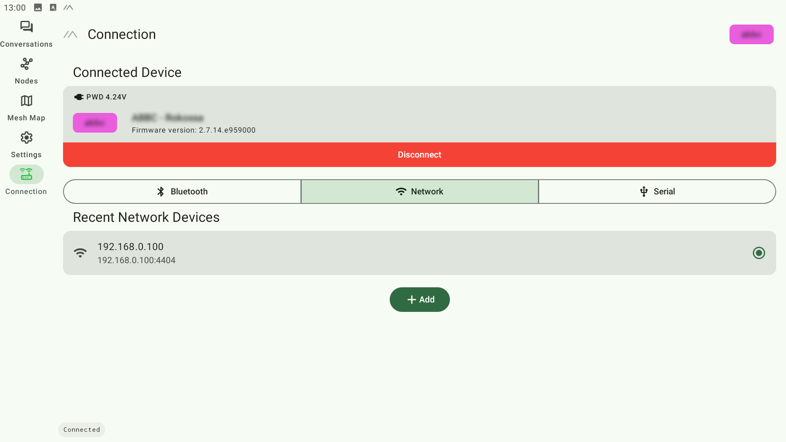](assets/img/01-Connection.png)
Выбрать доступный способ подключения. После удачной попытки коннекта вы увидете примерно это.
  

#### Секция настроек
[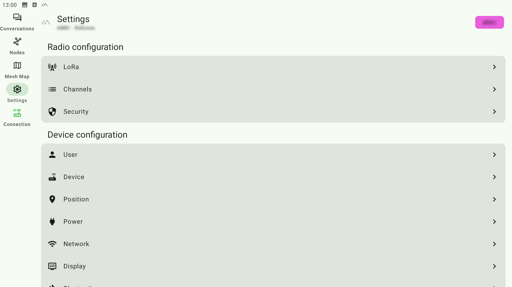](assets/img/02-Settings-main.png)
  

##### LoRa
[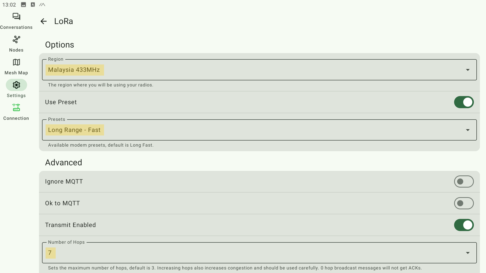](assets/img/03-Settings-Lora-01.png)
- регион, 
- вещательный пресет, 
- лимит "прыжков"

[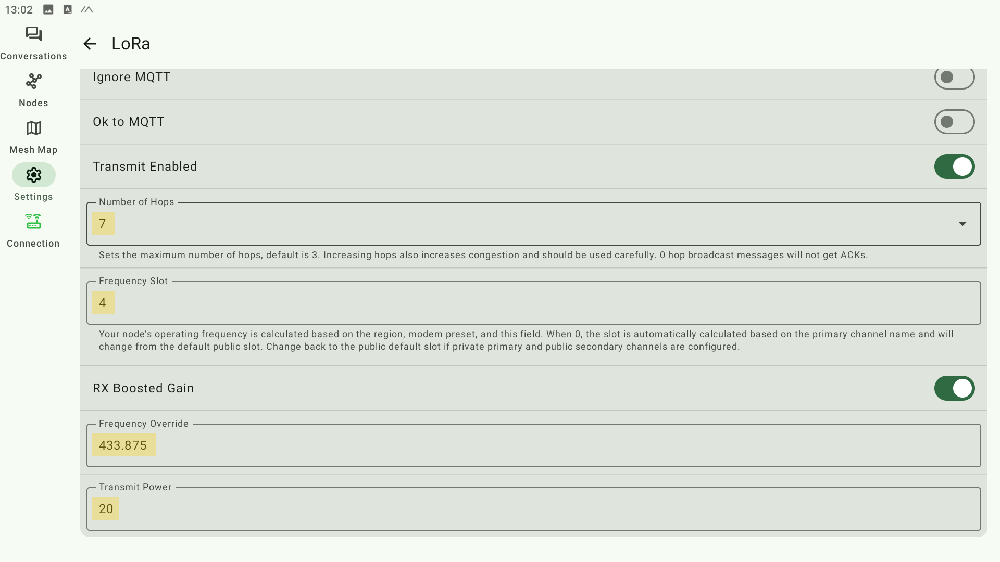](assets/img/04-Settings-Lora-02.png)
- частотный слот, 
- частота, 
- максимальная мощность передачи

Мощность выставляется с значением 20 dbm (с отключенным режимом HAM). Радиомодуль, получая это значение от прошивки в конфигурации, дополнительно увеличивает его в своей схеме до нужного значения. Детальнее как идет инициализация мощности можно увидеть через usb порт устройства в режиме ком порта, через ПО PUTTY в момент загрузки в логах на экране.

В случае стационарной сборки на модулях 33dBm, значение 22dBm подается на радиомодуль, и в итоге модуль выставляет значение 33dBm по факту. Тема неоднозначная, и желательно готовую сборку измерить на специальном приборе, измеряющем мощность радиосигнала.

!!! Опция "Override Duty Cicles" - позволяет обойти локальные ограничения, принятые в некоторых странах, связанные с лимитом времени работы устройства на передачу. В приложении под Андроид недоступно. Рекомендуется включить, используя веб-клиент.
  

##### Каналы
[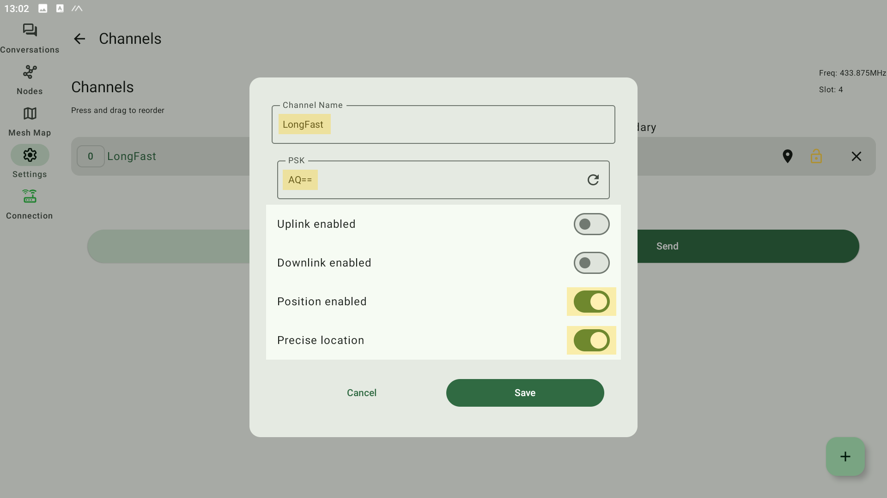](assets/img/05-Settings-Channels-LongFast.png)
- название канала (LongFast). Это общий канал. 
- ключ шифрования (для общего канала LongFast оставить как есть)
- включение транслирования позиции
- точное расположение

Рекомендуется убрать отображение с погрешностью, выставить “Precise Location”.
  

##### Безопасность
[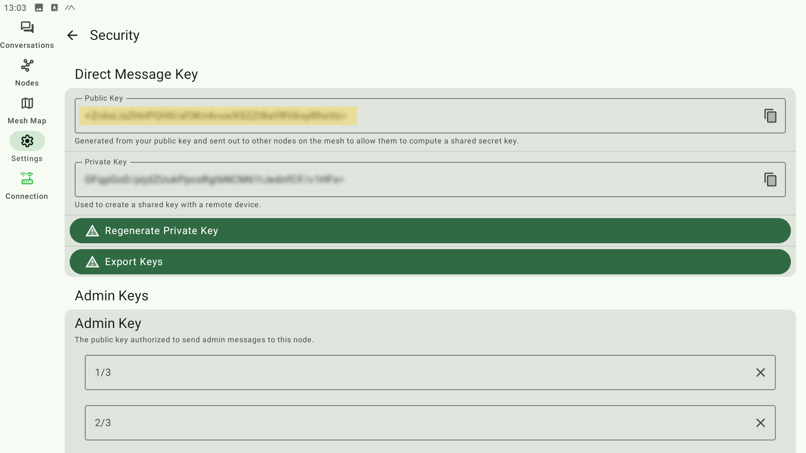](assets/img/06-Settings-Security-01.png)
- публичный ключ
- приватный ключ

Рекомендуется регулярно делать бекап ключей устройства и восстанавливать их в случае его перепрошивки со сбросом.
  

[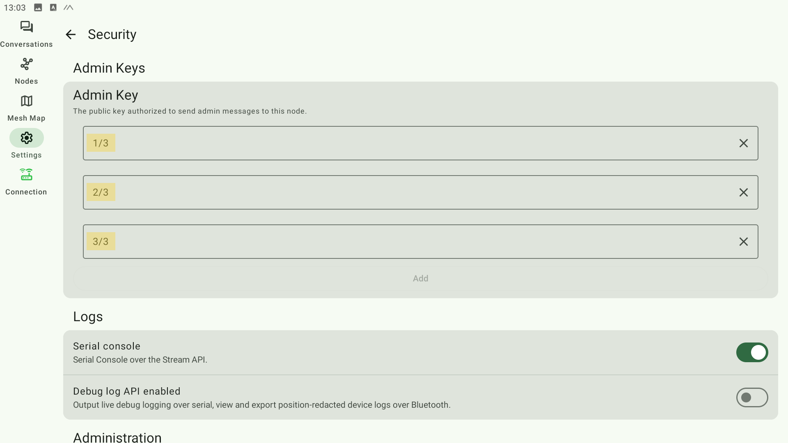](assets/img/07-Settings-Security-02.png)
- 3 слота для публичных ключей удаленного администрирования

[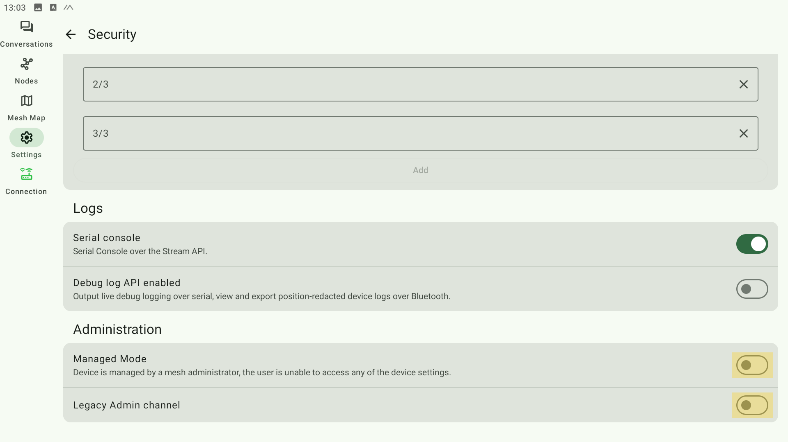](assets/img/08-Settings-Security-03.png)
- Режим удаленно администрируемой ноды (оставить по дефолту, иначе у ноды выключатся Wifi b BT)
- Устаревший режим удаленного администрирования (оставить по дефолту)
  

##### Пользователь
[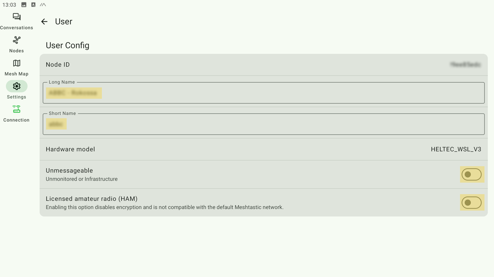](assets/img/09-Settings-User.png)
- Длинное имя ноды
- Короткое имя ноды
- Режим без поддержки приватных сообщений для инфраструктурных типов нод
- !!! режим **"Лицензированного пользователя"** или HAM. Не включать. В настоящий момент, в связи с увеличением численности пользователей, мы можем перейти на режим «не-HAM» с немного пониженной мощностью сигнала, но имеющий возможность включения шифрования, отсутствие drop пакетов при ретрансляции, признак корректной настройки - **зеленый замок** около имени ноды.
Убедитесь, что в списке нод ваша отображается c зеленым замком.

[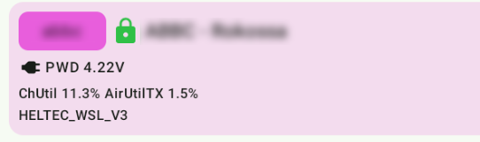](assets/img/09-01-Settings-User-02.png)
- Зеленый замок
  

##### Устройство
[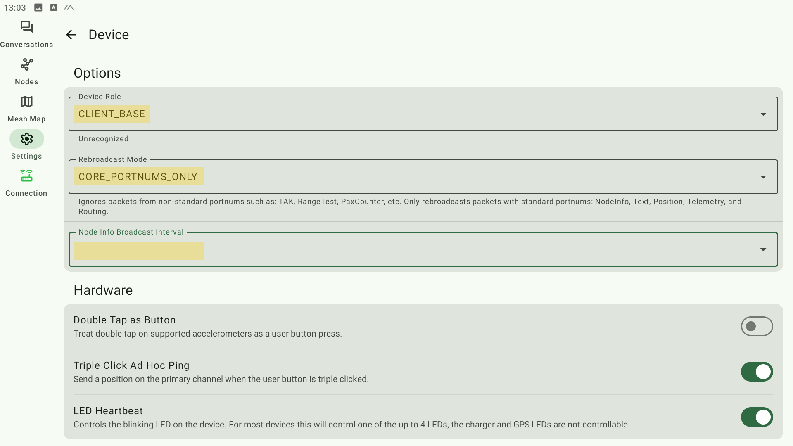](assets/img/10-Settings-Device-01.png)
- Роль устройства (Client или Client-Base)
- Режим ретрансляции
- Интервал ретрансляции. Рекомендуется 3600, в приложении под Андроид такое значение не выставляется. Рекомендуется подсоединиться веб-колиентом и настроить там.

[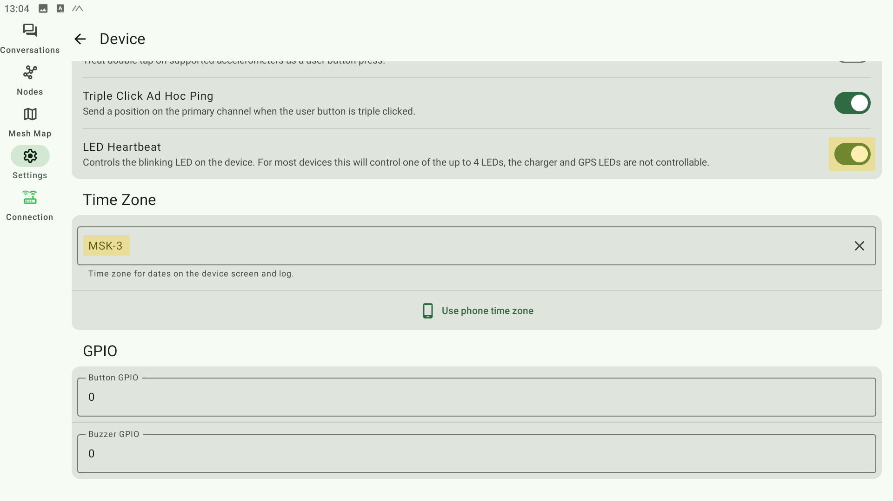](assets/img/11-Settings-Device-02.png)
- Отключение мерцания светодиода. Актуально для автономных нод с целью экономии энергии.
- Временная зона. 
  

##### Позиция
[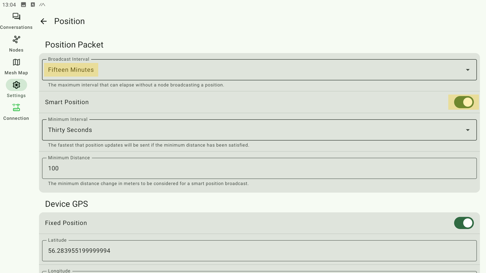](assets/img/12-Settings-Position-01.png)
- Интервал трансляции геопозиции.
- "Умный" режим геопозиции. Актуален для передвижных нод.

В зависимости от комфортного для вас уровня анонимности, вы можете выставить режим передачи координат GPS по сети. В среднем договорились о выставлении приблизительной координаты расположения ноды с погрешностью в один-два километра. Можно выставить режим передачи координат от встроенного GPS модуля, передачу координат со смартфона, передача фиксированных координат. 

[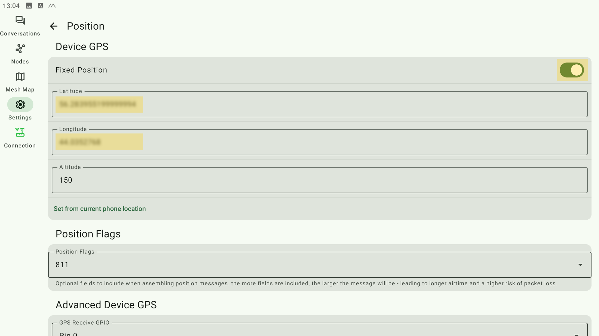](assets/img/13-Settings-Position-02.png)
- Режим фиксированной позиции для стационарных нод.
- Широта, толгота, высота над уровнем моря.
  

##### Питание
[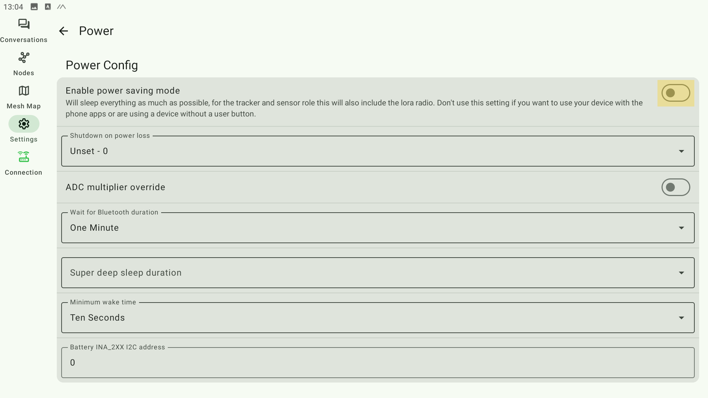](assets/img/14-Settings-Power.png)
- Режим экономии энергии. Применимо для автономных нод на солнечной батарее. 
  

##### Сеть
[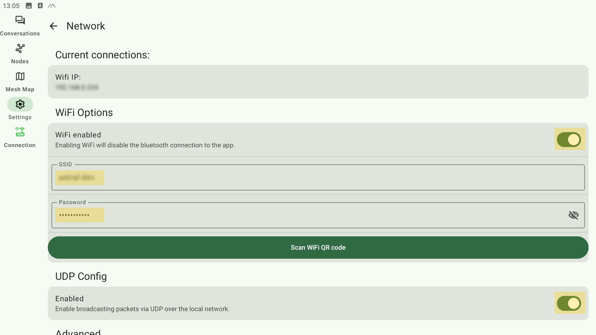](assets/img/15-Settings-Network.png)
- Включение WiFi
- Параметры коннекта к вашей WiFi точке. Если включен режим WiFi, чаще всего режим Bluetooth становится недоступным.
- Включение трансляции пакетов через UDP.
  

##### Bluetooth
[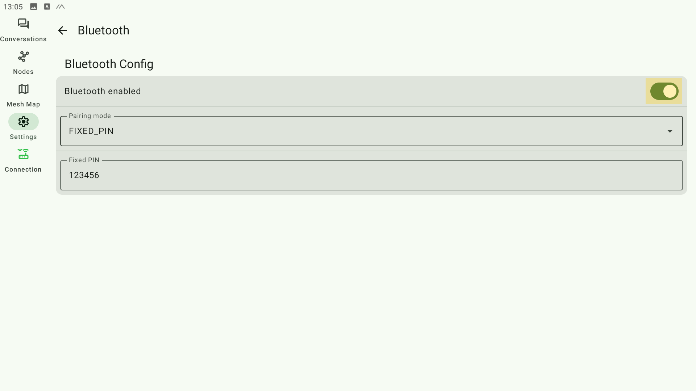](assets/img/16-Settings-Bluetooth.png)
- Включение связи с нодой по BT.
- Режим передачи PIN при соединении. Для устройств с экраном доступен выбор - либо показать его на экране, либо зафиксировать.
  

##### Разное
[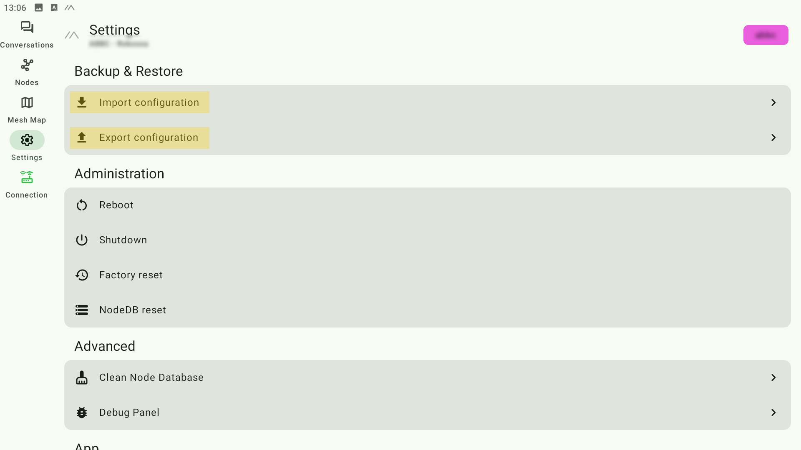](assets/img/17-Settings-Other.png)
- Импорт и экспорт конфигурации.
  

### Удаленное администрирование ноды

Это расширенная функция, предназначенная для опытных пользователей.

Кратко:
- В версиях прошивки 2.5 и выше, удалённое администрирование осуществляется путём сохранения открытого ключа локального узла в одном из полей «Ключ администратора» в конфигурации безопасности удалённого узла. **Этого полностью достаточно для того, чтобы узел управлялся удаленно**.
    1. Подключитесь к локальному узлу, который будет администрировать удаленный узел.
    1. Перейдите в раздел ⋮ > Конфигурация радио > Безопасность , чтобы найти его публичный ключ.
    1. Скопируйте публичный ключ, который будет использоваться для настройки удаленного узла.
    1. Подключитесь к узлу, который будет удаленно администрируемым узлом.
    1. Перейдите в то же меню «Безопасность» , что и на шаге 2, и нажмите «Добавить» , чтобы вставить публичный ключ локального узла в поле «Ключ администратора».
    1. Может быть предоставлено до 3 ключей администратора, по одному на поле, что позволяет использовать до 3 управляющих узлов.
    1. Включать опцию "Managed node" не нужно, иначе узел будет управляться **только** удаленно, либо по проводу. Все другие способы (WiFi, BLE) станут недоступными.

- В версиях прошивки 2.4.x и более ранних возможность удаленного администрирования достигается путём создания вторичного канала "admin" с общим PSK.
    Этот метод всё ещё поддерживается в прошивках версии 2.5 и более поздних, но его необходимо специально включить в настройках «Legacy Admin Channel» или "Legacy Admin" и он предназначен только для управления узлами версий **до 2.5**.
    Узел с прошивкой версии 2.5 и более поздних **не может управляться таким способом**.

Раздел удаленного администрирования в официальной документации с последовательностью действий для приложений под разные платформы:

[https://meshtastic.org/docs/configuration/remote-admin/?settings=android](https://meshtastic.org/docs/configuration/remote-admin/?settings=android)