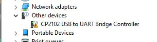

## Каким софтом прошивать ноду?

Прошивать с официального сайта, через [онлайн-flasher](https://flasher.meshtastic.org/).

Прошивать лучше актуальной **стабильной бета-версией**.
Альфа-версии - в экспериментальных целях, если есть желание потестировать новые возможности прошивки.

Перед прошивкой обязательно подключите антенну. Включение LoRa-модуля без антенны может повредить устройство.

Так же есть не официальный флешер - [Custom Meshtastic builds](https://mrekin.duckdns.org/flasher/). Основное отличие - прошивки с корректным отображением русского текста.

### Прошивка для стационарных нод

Использовать ПО Hydra т.к. там не ограничивается максимальная мощность радиомодуля, но учитывайте законодательство РФ.

Выбрать ПО последней стабильной версии.

Прошивать через USB кабель переходник, браузер Chrome, прошивать с полным удалением предыдущей прошивки и конфигурации.

### Прошивка мобильной ноды

Выбрать модель ноды

Выбрать ПО последней стабильной версии.

Прошивать через USB кабель переходник, браузер Chrome, прошивать с полным удалением предыдущей прошивки и конфигурации.

### Обновление ноды

Аналогично первоначальной прошивке, но рекомендуется сделать бэкап конфигурации или как минимум сохранить публичный и приватные ключи, т.к. при обновлении конфигурация может сброситься до "заводской". Особенно часто это происходит на альфа-версиях.

## Драйвера

Как правило, USB-UART чипы нод под Linux работают из коробки. Для Windows и MacOS могут понадобиться драйвера:

* [Silicon Labs CP210x](https://www.silabs.com/software-and-tools/usb-to-uart-bridge-vcp-drivers?tab=downloads).

## Разное

- RSSI — уровень сигнала (чем ближе к 0, тем лучше).
- SNR — отношение сигнал/шум.
